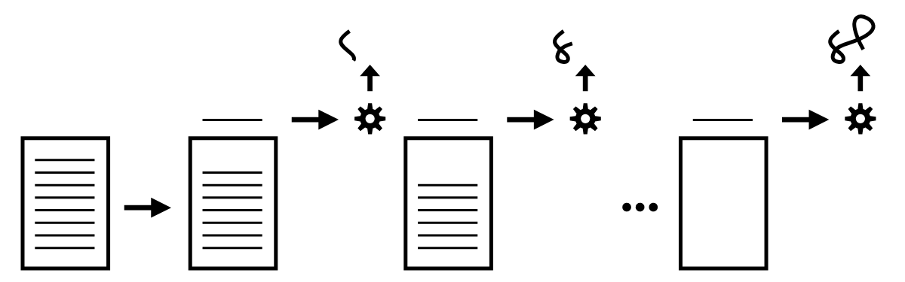
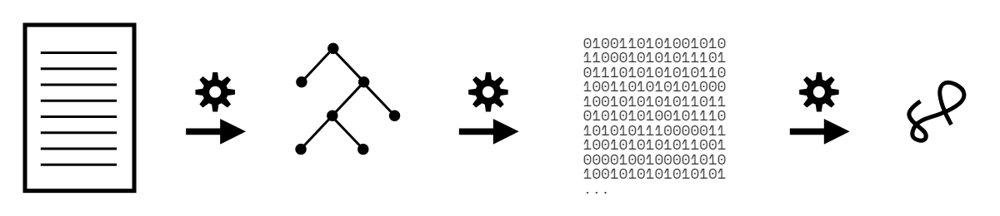
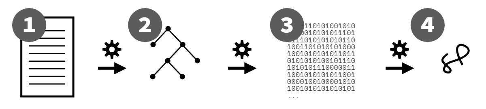

# You Don't Know JS Yet: Bắt Đầu - Ấn bản thứ 2

# Chương 1: JavaScript _Là Gì_?

Bạn chưa biết JS đâu, và mình cũng vậy, ít nhất là chưa hoàn toàn. Không ai trong chúng ta biết hết cả. Nhưng tất cả chúng ta đều có thể bắt đầu hiểu JS tốt hơn.

Trong chương đầu tiên của cuốn đầu tiên thuộc series _You Don't Know JS Yet_ (YDKJSY), chúng ta sẽ dành thời gian xây dựng nền tảng để tiến xa hơn. Chúng ta cần bắt đầu bằng việc làm rõ một số chi tiết nền tảng quan trọng, xóa bỏ những lầm tưởng và hiểu nhầm về bản chất thực sự của ngôn ngữ này (và những gì nó không phải!).

Đây là những hiểu biết giá trị về cách JS được tổ chức và duy trì; mọi lập trình viên JS nên hiểu điều này. Nếu bạn muốn hiểu JS, đây là cách để _bắt đầu_ những bước đầu tiên trên hành trình đó.

## Về Cuốn Sách Này

Mình nhấn mạnh từ "hành trình" vì _hiểu JS_ không phải là một điểm đến, mà là một hướng đi. Dù bạn dành bao nhiêu thời gian với ngôn ngữ này, bạn luôn có thể tìm thấy điều gì đó mới để học và hiểu sâu hơn. Vì vậy, đừng xem cuốn sách này như một thứ để lướt qua cho nhanh. Thay vào đó, sự kiên nhẫn và bền bỉ là điều tốt nhất khi bạn bắt đầu những bước đầu tiên này.

Sau chương nền tảng này, phần còn lại của cuốn sách sẽ vạch ra một bản đồ tổng quan về những gì bạn sẽ gặp khi đào sâu và nghiên cứu JS cùng các cuốn YDKJSY.

Đặc biệt, Chương 4 xác định ba trụ cột chính mà JS được tổ chức quanh đó: scope/closures, prototypes/objects, và types/coercion. JS là một ngôn ngữ rộng lớn và tinh vi, với nhiều tính năng và khả năng. Nhưng tất cả JS đều dựa trên ba trụ cột nền tảng này.

Hãy nhớ rằng dù cuốn sách này có tên là "Bắt Đầu", **nó không phải là sách nhập môn/dành cho người mới bắt đầu**. Nhiệm vụ chính của cuốn sách là giúp bạn sẵn sàng để nghiên cứu JS sâu hơn ở các cuốn tiếp theo; nó được viết với giả định bạn đã quen thuộc với JS ít nhất vài tháng trước khi tiếp tục với YDKJSY. Vì vậy, để tận dụng tối đa _Bắt Đầu_, hãy chắc chắn bạn dành nhiều thời gian viết code JS để tích lũy kinh nghiệm.

Ngay cả khi bạn đã từng viết nhiều JS trước đây, cuốn sách này cũng không nên bị lướt qua hoặc bỏ qua; hãy dành thời gian để thực sự thấm nhuần nội dung ở đây. **Một khởi đầu tốt luôn phụ thuộc vào bước đầu vững chắc.**

## Tên Gọi Đó Là Gì Vậy?

Tên JavaScript có lẽ là cái tên bị hiểu nhầm và nhầm lẫn nhiều nhất trong các ngôn ngữ lập trình.

Ngôn ngữ này có liên quan gì đến Java không? Nó chỉ là dạng script của Java thôi à? Nó chỉ dùng để viết script chứ không phải chương trình thực sự?

Sự thật là, cái tên JavaScript là sản phẩm của chiêu trò marketing. Khi Brendan Eich lần đầu nghĩ ra ngôn ngữ này, ông đặt tên mã là Mocha. Nội bộ tại Netscape, thương hiệu LiveScript được sử dụng. Nhưng khi đến lúc công bố tên chính thức, "JavaScript" đã thắng phiếu.

Tại sao? Vì ngôn ngữ này ban đầu được thiết kế để thu hút nhóm lập trình viên Java, và vì từ "script" lúc đó rất phổ biến để chỉ các chương trình nhẹ. Những "script" nhẹ này sẽ là những thứ đầu tiên được nhúng vào các trang trên cái gọi là web mới mẻ!

Nói cách khác, JavaScript là một chiêu trò marketing nhằm định vị ngôn ngữ này như một lựa chọn dễ chịu thay cho Java nặng nề và nổi tiếng thời đó. Nó cũng có thể đã được gọi là "WebJava" chẳng hạn.

Có một số điểm tương đồng bề ngoài giữa mã JavaScript và Java. Những điểm giống này không xuất phát từ việc phát triển chung, mà từ việc cả hai ngôn ngữ đều hướng tới lập trình viên quen cú pháp C (và phần nào là C++).

Ví dụ, chúng ta dùng `{` để bắt đầu một khối mã và `}` để kết thúc, giống như C/C++ và Java. Chúng ta cũng dùng `;` để kết thúc một câu lệnh.

Ở một số khía cạnh, mối quan hệ pháp lý còn sâu hơn cả cú pháp. Oracle (trước là Sun), công ty hiện vẫn sở hữu và vận hành Java, cũng sở hữu thương hiệu "JavaScript" (qua Netscape). Thương hiệu này gần như không bao giờ được thực thi, và có lẽ giờ cũng không thể.

Vì những lý do đó, một số người đề xuất nên dùng JS thay cho JavaScript. Đó là cách viết tắt rất phổ biến, nếu không muốn nói là ứng viên tốt cho việc đặt tên chính thức. Thực tế, các cuốn sách này gần như chỉ dùng JS để chỉ ngôn ngữ.

Để tránh xa hơn nữa khỏi thương hiệu thuộc sở hữu của Oracle, tên chính thức của ngôn ngữ do TC39 quy định và ECMA chuẩn hóa là **ECMAScript**. Và thực tế, từ năm 2016, tên chính thức của ngôn ngữ còn được gắn thêm năm phát hành; tại thời điểm viết sách này là ECMAScript 2019, hay viết tắt là ES2019.

Nói cách khác, JavaScript/JS mà bạn chạy trên trình duyệt hoặc Node.js là _một_ hiện thực của chuẩn ES2019.

| LƯU Ý:                                                                                                                                                                            |
| :-------------------------------------------------------------------------------------------------------------------------------------------------------------------------------- |
| Đừng dùng các thuật ngữ như "JS6" hay "ES8" để chỉ ngôn ngữ. Một số người có dùng, nhưng các thuật ngữ đó chỉ làm tăng thêm sự nhầm lẫn. Hãy dùng "ES20xx" hoặc đơn giản là "JS". |

Dù bạn gọi nó là JavaScript, JS, ECMAScript hay ES2019, thì chắc chắn nó **không phải** là một biến thể của Java!

> "Java với JavaScript cũng giống như ham với hamster." --Jeremy Keith, 2009

## Đặc Tả Ngôn Ngữ

Mình đã nhắc đến TC39, ủy ban kỹ thuật quản lý JS. Nhiệm vụ chính của họ là quản lý đặc tả chính thức cho ngôn ngữ. Họ họp thường xuyên để bỏ phiếu cho các thay đổi đã được đồng thuận, sau đó gửi lên ECMA, tổ chức tiêu chuẩn hóa.

Cú pháp và hành vi của JS được định nghĩa trong đặc tả ES.

ES2019 là phiên bản đặc tả lớn thứ 10 kể từ khi JS ra đời năm 1995, nên trong URL chính thức của đặc tả do ECMA lưu trữ, bạn sẽ thấy "10.0":

https://www.ecma-international.org/ecma-262/10.0/

Ủy ban TC39 gồm từ 50 đến khoảng 100 người đến từ nhiều công ty liên quan đến web, như các hãng trình duyệt (Mozilla, Google, Apple) và các hãng thiết bị (Samsung, v.v.). Tất cả thành viên đều là tình nguyện viên, dù nhiều người trong số họ là nhân viên các công ty này và có thể được trả lương một phần cho công việc trong ủy ban.

TC39 thường họp khoảng hai tháng một lần, mỗi lần khoảng ba ngày, để xem xét công việc đã làm từ lần họp trước, thảo luận các vấn đề và bỏ phiếu cho các đề xuất. Địa điểm họp luân phiên giữa các công ty thành viên sẵn sàng đăng cai.

Tất cả đề xuất của TC39 đều đi qua quy trình năm giai đoạn—tất nhiên, vì chúng ta là lập trình viên nên đánh số từ 0!—Giai đoạn 0 đến Giai đoạn 4. Bạn có thể đọc thêm về quy trình này tại: https://tc39.es/process-document/

Giai đoạn 0 nghĩa là, ai đó trong TC39 nghĩ đó là ý tưởng đáng giá và sẵn sàng bảo trợ, phát triển nó. Điều đó có nghĩa là rất nhiều ý tưởng mà người ngoài TC39 "đề xuất" qua mạng xã hội hay blog thực ra chỉ là "trước giai đoạn 0". Bạn phải có thành viên TC39 bảo trợ thì đề xuất mới được coi là "Giai đoạn 0" chính thức.

Khi một đề xuất đạt "Giai đoạn 4", nó đủ điều kiện để đưa vào bản cập nhật hàng năm tiếp theo của ngôn ngữ. Có thể mất từ vài tháng đến vài năm để một đề xuất đi hết các giai đoạn này.

Tất cả đề xuất được quản lý công khai trên Github của TC39: https://github.com/tc39/proposals

Bất kỳ ai, dù là thành viên TC39 hay không, đều có thể tham gia thảo luận công khai và quy trình phát triển các đề xuất. Tuy nhiên, chỉ thành viên TC39 mới được dự họp và bỏ phiếu. Vì vậy, tiếng nói của thành viên TC39 có trọng lượng lớn trong việc định hướng JS.

Trái với một số lầm tưởng phổ biến, **không** có nhiều phiên bản JavaScript ngoài thực tế. Chỉ có **một JS**, chuẩn chính thức do TC39 và ECMA duy trì.

Đầu những năm 2000, khi Microsoft duy trì một phiên bản JS "fork" và đảo ngược (không hoàn toàn tương thích) gọi là "JScript", khi đó thực sự có "nhiều phiên bản" JS. Nhưng thời đó đã qua lâu rồi. Giờ nói như vậy là lỗi thời và không chính xác.

Tất cả các trình duyệt lớn và nhà sản xuất thiết bị đều cam kết giữ cho hiện thực JS của họ tuân thủ chuẩn trung tâm này. Tất nhiên, các engine sẽ triển khai tính năng ở các thời điểm khác nhau. Nhưng không bao giờ nên có chuyện engine v8 (JS của Chrome) triển khai một tính năng khác hoặc không tương thích với engine SpiderMonkey (JS của Mozilla).

Điều đó nghĩa là bạn chỉ cần học **một JS**, và có thể tin tưởng JS đó ở mọi nơi.

Nhưng sự hỗn loạn và không xác định sẽ xảy ra nếu engine của một ngôn ngữ lập trình tự ý bỏ qua các câu lệnh (hoặc thậm chí là biểu thức!) mà nó không hiểu, vì không thể đảm bảo rằng phần sau của chương trình không mong đợi phần bị bỏ qua đó đã được xử lý.

Dù JS không (và không thể) tương thích tiến (forwards-compatible), điều quan trọng là phải nhận ra tính tương thích ngược (backwards compatibility) của JS, bao gồm cả những lợi ích lâu dài cho web và cả những ràng buộc, khó khăn mà nó mang lại cho JS.

### Vượt Qua Khoảng Cách

Vì JS không tương thích tiến, nên luôn có khả năng xuất hiện khoảng cách giữa mã bạn có thể viết (hợp lệ với JS mới) và engine JS cũ nhất mà trang web hoặc ứng dụng của bạn cần hỗ trợ. Nếu bạn chạy một chương trình sử dụng tính năng ES2019 trên engine từ năm 2016, rất có thể chương trình sẽ bị lỗi và dừng.

Nếu tính năng đó là cú pháp mới, chương trình thường sẽ không thể biên dịch và chạy, thường báo lỗi cú pháp. Nếu là API mới (như `Object.is(..)` của ES6), chương trình có thể chạy đến một điểm nào đó rồi ném ra lỗi runtime khi gặp tham chiếu đến API chưa biết.

Vậy điều này có nghĩa là lập trình viên JS luôn phải đi chậm hơn tiến trình phát triển, chỉ dùng mã tương thích với engine JS cũ nhất cần hỗ trợ? Không!

Nhưng nó có nghĩa là lập trình viên JS cần chú ý đặc biệt để xử lý khoảng cách này.

Với cú pháp mới không tương thích, giải pháp là transpiling. Transpiling là một thuật ngữ do cộng đồng sáng tạo ra để chỉ việc dùng công cụ chuyển đổi mã nguồn chương trình từ dạng này sang dạng khác (nhưng vẫn là mã nguồn văn bản). Thông thường, các vấn đề tương thích tiến liên quan đến cú pháp được giải quyết bằng transpiler (phổ biến nhất là Babel (https://babeljs.io)) để chuyển từ cú pháp JS mới sang cú pháp cũ tương đương.

Ví dụ, một lập trình viên có thể viết đoạn mã như sau:

```js
if (something) {
    let x = 3;
    console.log(x);
} else {
    let x = 4;
    console.log(x);
}
```

Đây là cách đoạn mã xuất hiện trong cây mã nguồn của ứng dụng. Nhưng khi tạo file để triển khai lên website, transpiler Babel có thể chuyển mã thành:

```js
var x$0, x$1;
if (something) {
    x$0 = 3;
    console.log(x$0);
} else {
    x$1 = 4;
    console.log(x$1);
}
```

Đoạn mã gốc dựa vào `let` để tạo biến `x` có phạm vi block trong cả `if` và `else`, không ảnh hưởng lẫn nhau. Một chương trình tương đương (với thay đổi tối thiểu) mà Babel tạo ra chỉ đơn giản là đặt tên hai biến khác nhau, đạt được kết quả không ảnh hưởng lẫn nhau như mong muốn.

| LƯU Ý:                                                                                                                                                                                                                                                                                                                                                          |
| :-------------------------------------------------------------------------------------------------------------------------------------------------------------------------------------------------------------------------------------------------------------------------------------------------------------------------------------------------------------- |
| Từ khóa `let` được thêm vào ES6 (2015). Ví dụ transpiling ở trên chỉ cần thiết nếu ứng dụng cần chạy trên môi trường JS trước ES6. Khi ES6 mới ra, nhu cầu transpile như vậy rất phổ biến, nhưng đến 2020 thì ít cần hỗ trợ môi trường cũ hơn ES6. "Target" dùng cho transpile là một cửa sổ trượt, tăng dần khi quyết định ngừng hỗ trợ trình duyệt/engine cũ. |

Bạn có thể thắc mắc: tại sao phải dùng công cụ chuyển cú pháp mới về cú pháp cũ? Sao không viết luôn hai biến và bỏ qua `let`? Lý do là, rất khuyến khích lập trình viên dùng phiên bản JS mới nhất để mã sạch và truyền đạt ý tưởng hiệu quả nhất.

Lập trình viên nên tập trung viết mã với cú pháp mới, sạch, và để công cụ lo việc tạo ra phiên bản tương thích tiến phù hợp để triển khai trên môi trường JS cũ nhất cần hỗ trợ.

### Lấp Đầy Khoảng Cách

Nếu vấn đề tương thích tiến không liên quan đến cú pháp mới mà là thiếu API vừa được thêm vào, giải pháp phổ biến là tự định nghĩa API đó để giả lập như môi trường cũ đã có sẵn. Mẫu này gọi là polyfill (hoặc "shim").

Xem ví dụ sau:

```js
// getSomeRecords() trả về một promise cho dữ liệu sẽ lấy
var pr = getSomeRecords();

// hiển thị spinner UI trong lúc lấy dữ liệu
startSpinner();

pr.then(renderRecords) // render nếu thành công
    .catch(showError) // báo lỗi nếu thất bại
    .finally(hideSpinner); // luôn ẩn spinner
```

Đoạn mã này dùng tính năng ES2019, phương thức `finally(..)` trên promise prototype. Nếu chạy trên môi trường trước ES2019, phương thức này không tồn tại và sẽ gây lỗi.

Một polyfill cho `finally(..)` trên môi trường cũ có thể như sau:

```js
if (!Promise.prototype.finally) {
    Promise.prototype.finally = function f(fn) {
        return this.then(
            function t(v) {
                return Promise.resolve(fn()).then(function t() {
                    return v;
                });
            },
            function c(e) {
                return Promise.resolve(fn()).then(function t() {
                    throw e;
                });
            }
        );
    };
}
```

| CẢNH BÁO:                                                                                                                                                                                       |
| :---------------------------------------------------------------------------------------------------------------------------------------------------------------------------------------------- |
| Đây chỉ là ví dụ đơn giản (không hoàn toàn đúng chuẩn) về polyfill cho `finally(..)`. Đừng dùng polyfill này cho mã thực tế; luôn dùng polyfill chính thức, ví dụ bộ polyfill/shim của ES-Shim. |

Câu lệnh `if` bảo vệ định nghĩa polyfill, chỉ chạy trên môi trường chưa có sẵn phương thức này. Trên môi trường mới, câu lệnh `if` sẽ bị bỏ qua.

Các transpiler như Babel thường tự động phát hiện và cung cấp polyfill cần thiết cho mã của bạn. Nhưng đôi khi bạn cần tự thêm vào, cách làm cũng tương tự ví dụ trên.

Hãy luôn viết mã dùng tính năng phù hợp nhất để truyền đạt ý tưởng hiệu quả. Nói chung, nên dùng phiên bản JS ổn định mới nhất. Tránh làm mã khó đọc chỉ vì cố tự xử lý khoảng cách cú pháp/API. Đó là việc của công cụ!

Transpiling và polyfill là hai kỹ thuật rất hiệu quả để xử lý khoảng cách giữa mã dùng tính năng mới nhất và môi trường cũ cần hỗ trợ. Vì JS sẽ không ngừng phát triển, khoảng cách này sẽ không bao giờ biến mất. Hãy coi cả hai kỹ thuật là một phần tiêu chuẩn trong chuỗi sản xuất của mọi dự án JS.

## Diễn Giải Hay Biên Dịch?

Một câu hỏi tranh luận lâu dài về mã JS: nó là script diễn giải (interpreted) hay chương trình biên dịch (compiled)? Đa số cho rằng JS là ngôn ngữ diễn giải (scripting). Nhưng thực tế phức tạp hơn thế.

Trong phần lớn lịch sử ngôn ngữ lập trình, ngôn ngữ "diễn giải" và "script" thường bị coi nhẹ so với ngôn ngữ biên dịch. Lý do có nhiều, bao gồm quan niệm thiếu tối ưu hiệu năng, cũng như không thích một số đặc điểm như script thường dùng kiểu động thay vì kiểu tĩnh "trưởng thành" hơn.

Ngôn ngữ được coi là "biên dịch" thường tạo ra dạng thực thi (binary) để phân phối và chạy sau này. Vì JS không thực sự theo mô hình đó (chúng ta phân phối mã nguồn, không phải binary), nhiều người cho rằng JS không phải ngôn ngữ biên dịch. Thực tế, mô hình phân phối dạng "thực thi" của chương trình đã thay đổi rất nhiều và không còn quá quan trọng như trước; với câu hỏi này, dạng phân phối không còn là yếu tố quyết định.

Những quan niệm và chỉ trích sai lầm này nên được gạt sang một bên. Lý do thực sự cần làm rõ JS là diễn giải hay biên dịch liên quan đến cách xử lý lỗi.

Lịch sử, ngôn ngữ script/diễn giải thường thực thi từ trên xuống, từng dòng một; thường không có bước xử lý trước khi chạy (xem Hình 1).

<figure>
    
    <figcaption><em>Hình 1: Thực thi Script/Diễn giải</em></figcaption>
    <br><br>
</figure>

Với ngôn ngữ script/diễn giải, lỗi ở dòng 5 sẽ không được phát hiện cho đến khi dòng 1-4 đã chạy xong. Đáng chú ý, lỗi ở dòng 5 có thể do điều kiện runtime (giá trị biến không phù hợp) hoặc do câu lệnh sai cú pháp. Tùy ngữ cảnh, việc phát hiện lỗi tại dòng xảy ra có thể là điều mong muốn hoặc không.

So sánh với ngôn ngữ có bước xử lý trước (thường gọi là parsing) trước khi chạy, như minh họa ở Hình 2:

<figure>
    
    <figcaption><em>Hình 2: Phân tích cú pháp + Biên dịch + Thực thi</em></figcaption>
    <br><br>
</figure>

Với mô hình này, lệnh không hợp lệ (ví dụ sai cú pháp) ở dòng 5 sẽ bị phát hiện trong giai đoạn parsing, trước khi chạy, và toàn bộ chương trình sẽ không chạy. Để phát hiện lỗi cú pháp (hoặc lỗi "tĩnh"), thường nên biết trước khi chạy chương trình.

Vậy ngôn ngữ "được phân tích cú pháp" có gì giống với ngôn ngữ "biên dịch"? Thứ nhất, mọi ngôn ngữ biên dịch đều được parsing. Vậy ngôn ngữ được parsing đã tiến khá xa trên con đường trở thành ngôn ngữ biên dịch. Theo lý thuyết biên dịch cổ điển, bước cuối cùng sau parsing là sinh mã thực thi.

Khi mã nguồn đã được parsing, việc thực thi thường sẽ bao gồm chuyển đổi từ dạng đã parsed—thường gọi là Abstract Syntax Tree (AST)—sang dạng thực thi.

Nói cách khác, ngôn ngữ được parsing thường cũng sinh mã thực thi trước khi chạy, nên không quá khi nói về bản chất, chúng là ngôn ngữ biên dịch.

Mã nguồn JS được parsing trước khi thực thi. Đặc tả yêu cầu như vậy, vì có "early errors"—lỗi tĩnh như trùng tên tham số—phải được báo trước khi chạy. Những lỗi này không thể phát hiện nếu không parsing trước.

Vậy **JS là ngôn ngữ được parsing**, nhưng có phải _biên dịch_ không?

Câu trả lời nghiêng về có hơn là không. JS sau khi parsing sẽ được chuyển thành dạng nhị phân tối ưu (binary), và "mã" này sẽ được JS virtual machine thực thi (Hình 2); engine không chuyển lại sang chế độ thực thi từng dòng (Hình 1) sau khi đã parsing—đa số ngôn ngữ/engine sẽ không làm vậy vì rất kém hiệu quả.

Cụ thể, "biên dịch" này tạo ra byte code nhị phân, sau đó được JS virtual machine thực thi. Một số người nói VM này "diễn giải" byte code. Nhưng như vậy thì Java và nhiều ngôn ngữ chạy trên JVM cũng là diễn giải chứ không phải biên dịch. Điều này mâu thuẫn với quan niệm Java là ngôn ngữ biên dịch.

Thú vị là, dù Java và JavaScript rất khác nhau, câu hỏi diễn giải/biên dịch lại khá tương đồng giữa chúng!

Một điểm nữa là engine JS có thể thực hiện nhiều lần JIT (Just-In-Time) tối ưu hóa trên mã đã sinh (sau parsing), điều này cũng có thể gọi là "biên dịch" hoặc "diễn giải" tùy góc nhìn. Thực tế, bên trong engine JS rất phức tạp.

Vậy tóm lại, hãy nhìn toàn bộ luồng xử lý mã nguồn JS:

1. Sau khi rời editor, chương trình được transpile bởi Babel, đóng gói bởi Webpack (và có thể nhiều bước khác), rồi được chuyển đến engine JS dưới dạng rất khác.
2. Engine JS parsing mã thành AST.
3. Engine chuyển AST thành dạng byte code, một dạng nhị phân trung gian (IR), rồi tiếp tục tối ưu hóa qua JIT compiler.
4. Cuối cùng, JS VM thực thi chương trình.

Hình dung các bước này:

<figure>
    
    <figcaption><em>Hình 3: Parsing, Biên dịch và Thực thi JS</em></figcaption>
    <br><br>
</figure>

JS được xử lý giống script diễn giải từng dòng (Hình 1), hay giống ngôn ngữ biên dịch qua nhiều bước trước khi chạy (Hình 2, 3)?

Mình nghĩ rõ ràng về bản chất, nếu không phải về thực tế, **JS là ngôn ngữ biên dịch**.

Và lý do điều này quan trọng là, vì JS được biên dịch, chúng ta sẽ biết lỗi tĩnh (như sai cú pháp) trước khi mã chạy. Đây là mô hình tương tác rất khác với script truyền thống, và có thể hữu ích hơn!

### Web Assembly (WASM)

Một mối quan tâm lớn thúc đẩy sự phát triển của JS là hiệu năng, cả về tốc độ parsing/biên dịch lẫn tốc độ thực thi mã đã biên dịch.

Năm 2013, kỹ sư Mozilla Firefox trình diễn việc port engine game Unreal 3 từ C sang JS. Khả năng chạy mã này trên trình duyệt ở tốc độ 60fps dựa vào tối ưu hóa mà engine JS có thể thực hiện, nhờ mã JS của Unreal engine dùng một phong cách đặc biệt, gọi là "ASM.js".

ASM.js là một tập con hợp lệ của JS, được viết theo cách khá lạ so với mã thông thường, nhưng truyền đạt thông tin kiểu dữ liệu quan trọng cho engine để tối ưu hóa. ASM.js được giới thiệu như một cách giải quyết áp lực hiệu năng runtime của JS.

Nhưng lưu ý, ASM.js không nhằm để lập trình viên tự viết, mà là kết quả của việc transpile từ ngôn ngữ khác (như C), nơi các "annotation" kiểu dữ liệu được công cụ tự động chèn vào.

Vài năm sau khi ASM.js chứng minh tính khả thi của mã do công cụ tạo ra, một nhóm kỹ sư khác (cũng từ Mozilla) phát triển Web Assembly (WASM).

WASM tương tự ASM.js ở chỗ ban đầu nhằm cung cấp đường dẫn cho chương trình không phải JS (C, v.v.) chuyển thành dạng có thể chạy trên engine JS. Nhưng khác ASM.js, WASM còn giải quyết độ trễ parsing/biên dịch JS trước khi chạy, bằng cách biểu diễn chương trình ở dạng hoàn toàn khác JS.

WASM là định dạng gần giống Assembly (do đó có tên này), có thể được engine JS xử lý mà không cần parsing/biên dịch như JS thông thường. Việc parsing/biên dịch chương trình WASM diễn ra trước (AOT); thứ được phân phối là chương trình nhị phân sẵn sàng để engine JS thực thi với xử lý tối thiểu.

Động lực ban đầu của WASM là cải thiện hiệu năng. Dù đây vẫn là trọng tâm, WASM còn hướng tới việc đưa các ngôn ngữ không phải JS lên web dễ dàng hơn. Ví dụ, nếu Go hỗ trợ lập trình đa luồng, còn JS thì không, WASM cho phép chương trình Go chuyển thành dạng engine JS hiểu được mà không cần JS hỗ trợ threads.

Nói cách khác, WASM giúp giảm áp lực phải thêm các tính năng vào JS chỉ để phục vụ các chương trình được transpile từ ngôn ngữ khác. Điều đó nghĩa là việc phát triển tính năng JS (do TC39 quyết định) sẽ không bị ảnh hưởng bởi nhu cầu từ các hệ sinh thái ngôn ngữ khác, trong khi các ngôn ngữ đó vẫn có đường lên web.

Một góc nhìn khác về WASM đang nổi lên là, thú vị thay, không chỉ liên quan đến web (W). WASM đang phát triển thành một dạng máy ảo (VM) đa nền tảng, nơi chương trình có thể biên dịch một lần và chạy trên nhiều môi trường hệ thống khác nhau.

Vậy nên, WASM không chỉ dành cho web, và WASM cũng không phải là JS. Trớ trêu thay, dù WASM chạy trong engine JS, JS lại là một trong những ngôn ngữ ít phù hợp nhất để sinh chương trình WASM, vì WASM phụ thuộc nhiều vào thông tin kiểu tĩnh. Ngay cả TypeScript (TS)—về lý thuyết là JS + kiểu tĩnh—cũng chưa thực sự phù hợp để transpile sang WASM, dù các biến thể như AssemblyScript đang cố gắng lấp khoảng cách giữa JS/TS và WASM.

Cuốn sách này không nói về WASM, nên mình sẽ không bàn sâu thêm, chỉ nhấn mạnh một điểm cuối. _Một số_ người cho rằng WASM sẽ mở ra tương lai nơi JS bị loại bỏ hoặc thu nhỏ trên web. Những người này thường không thích JS và muốn ngôn ngữ khác thay thế. Vì WASM cho phép ngôn ngữ khác chạy trên engine JS, nên bề ngoài điều này nghe có vẻ hợp lý.

Nhưng mình xin khẳng định: WASM sẽ không thay thế JS. WASM sẽ bổ sung mạnh mẽ cho những gì web (bao gồm cả JS) có thể làm được. Đó là điều tuyệt vời, hoàn toàn không liên quan đến việc có người dùng nó để "thoát khỏi" JS hay không.

## *Strict*ly Speaking

Năm 2009, khi ES5 ra mắt, JS bổ sung _strict mode_ như một cơ chế tùy chọn để khuyến khích viết JS tốt hơn.

Lợi ích của strict mode vượt xa chi phí, nhưng thói quen cũ rất khó thay đổi và inertia của mã cũ (legacy) rất khó dịch chuyển. Đáng tiếc, hơn 10 năm sau, tính _tùy chọn_ của strict mode vẫn khiến nó chưa phải mặc định cho lập trình viên JS.

Tại sao cần strict mode? Strict mode không nên bị xem là hạn chế những gì bạn không làm được, mà là hướng dẫn cách tốt nhất để JS engine tối ưu và chạy mã hiệu quả nhất. Đa số mã JS được làm việc theo nhóm, nên tính _nghiêm ngặt_ của strict mode (cùng các công cụ như linter!) giúp hợp tác hiệu quả hơn bằng cách tránh lỗi khó chịu mà non-strict mode dễ bỏ qua.

Phần lớn kiểm soát của strict mode là _early errors_, tức lỗi không phải cú pháp nhưng vẫn bị báo ở thời điểm biên dịch (trước khi chạy). Ví dụ, strict mode không cho phép đặt trùng tên tham số hàm, và sẽ báo lỗi sớm. Một số kiểm soát khác chỉ thấy ở runtime, như `this` mặc định là `undefined` thay vì global object.

Thay vì chống đối strict mode như một đứa trẻ thích làm ngược lời cha mẹ, hãy xem strict mode như linter nhắc bạn viết JS đúng chuẩn, chất lượng và hiệu năng tốt nhất. Nếu bạn cảm thấy bị "trói tay" khi phải lách strict mode, đó là dấu hiệu đỏ cho thấy bạn nên xem lại toàn bộ cách tiếp cận.

Strict mode được bật theo file bằng một pragma đặc biệt (không được có gì phía trước ngoài comment/khoảng trắng):

```js
// chỉ được phép có khoảng trắng và comment trước pragma use-strict
"use strict";
// phần còn lại của file sẽ chạy ở strict mode
```

| CẢNH BÁO:                                                                                                                                                                                      |
| :--------------------------------------------------------------------------------------------------------------------------------------------------------------------------------------------- |
| Lưu ý, chỉ cần một dấu `;` lạc trước pragma strict mode cũng sẽ khiến pragma vô tác dụng; không báo lỗi vì JS cho phép string literal ở vị trí statement, nhưng strict mode sẽ không được bật! |

Strict mode cũng có thể bật theo phạm vi hàm, với quy tắc tương tự:

```js
function someOperations() {
    // khoảng trắng và comment ở đây đều được
    "use strict";

    // toàn bộ mã trong hàm này sẽ chạy ở strict mode
}
```

Thú vị là, nếu file đã bật strict mode, thì không được bật strict mode ở cấp hàm nữa. Bạn phải chọn một trong hai.

**Chỉ** nên dùng strict mode theo hàm khi chuyển đổi dần file mã cũ chưa strict sang strict. Còn lại, tốt nhất là bật strict mode cho toàn bộ file/chương trình.

Nhiều người thắc mắc liệu JS có bao giờ mặc định strict mode không? Câu trả lời gần như chắc chắn là không. Như đã nói về tương thích ngược, nếu engine JS tự động giả định mã là strict mode dù không đánh dấu, có thể mã sẽ bị lỗi do các kiểm soát của strict mode.

Tuy nhiên, có vài yếu tố giúp giảm tác động của việc strict mode không mặc định này.

Thứ nhất, hầu hết mã JS đã được transpile đều ở strict mode dù mã gốc không viết như vậy. Đa số mã JS production đều đã transpile, nên thực tế đa số JS đã tuân thủ strict mode. Có thể "gỡ" assumption này, nhưng phải cố tình làm, nên rất hiếm gặp.

Thứ hai, xu hướng mạnh mẽ là mã JS mới dùng định dạng module ES6. Module ES6 mặc định strict mode, nên toàn bộ mã trong file module sẽ tự động strict.

Tổng hợp lại, strict mode về cơ bản đã là mặc định trên thực tế, dù về kỹ thuật thì chưa phải mặc định.

## Định Nghĩa

JS là hiện thực của chuẩn ECMAScript (phiên bản ES2019 tại thời điểm viết sách), do ủy ban TC39 dẫn dắt và ECMA quản lý. JS chạy trên trình duyệt và các môi trường khác như Node.js.

JS là ngôn ngữ đa mô hình (multi-paradigm), nghĩa là cú pháp và khả năng cho phép lập trình viên kết hợp (và biến tấu!) các khái niệm từ nhiều mô hình lớn như thủ tục, hướng đối tượng (OO/classes), và hàm (FP).

JS là ngôn ngữ biên dịch, nghĩa là công cụ (bao gồm cả engine JS) sẽ xử lý và kiểm tra chương trình (báo lỗi nếu có!) trước khi chạy.

Giờ khi ngôn ngữ đã được _định nghĩa_, hãy bắt đầu tìm hiểu sâu hơn về nó.

[^specApB]: ECMAScript 2019 Language Specification, Appendix B: Additional ECMAScript Features for Web Browsers, https://www.ecma-international.org/ecma-262/10.0/#sec-additional-ecmascript-features-for-web-browsers (cập nhật mới nhất tháng 1/2020)
