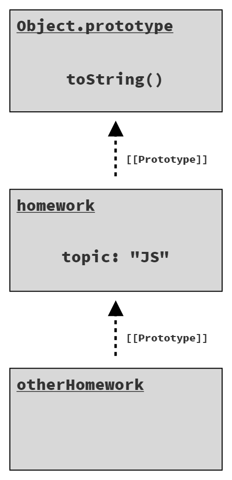
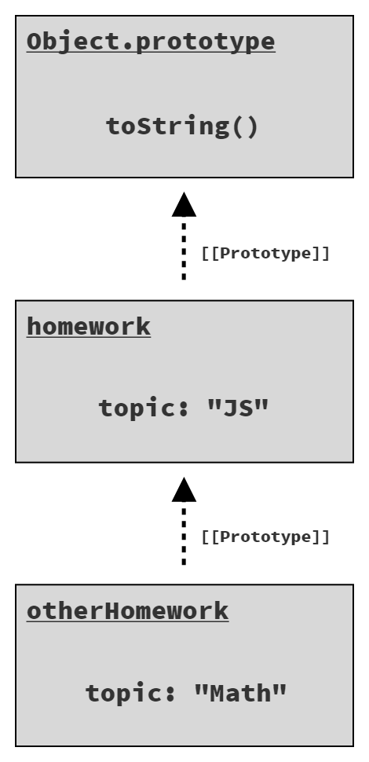
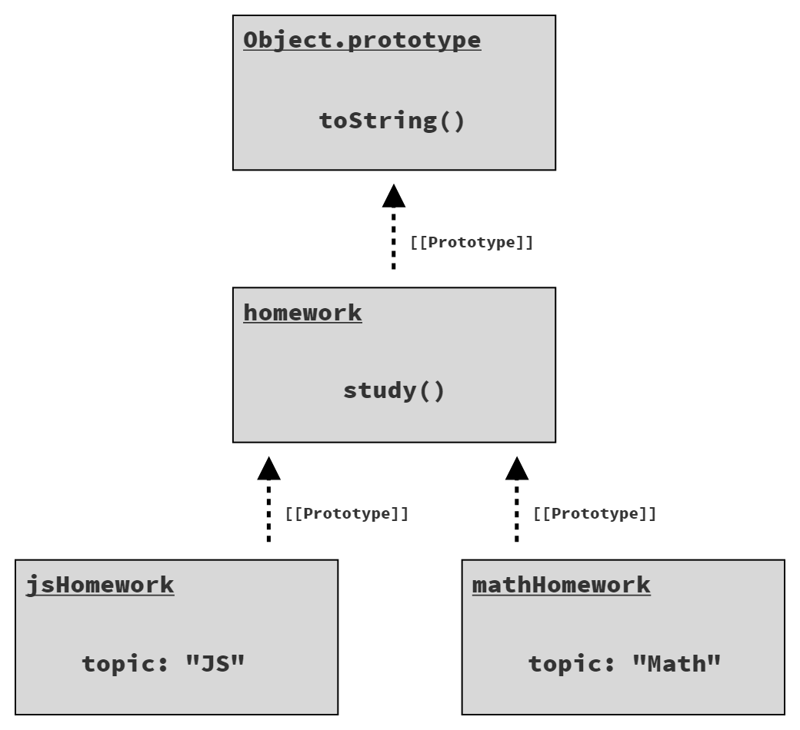

# Chương 3: Đào Sâu Vào Gốc Rễ JS

Nếu bạn đã đọc chương 1 và 2, và dành thời gian nghiền ngẫm, hy vọng bạn đã bắt đầu _cảm_ được JS hơn một chút. Nếu bạn bỏ qua/lướt nhanh (đặc biệt là chương 2), mình khuyên nên quay lại đọc kỹ hơn.

Ở chương 2, chúng ta khảo sát cú pháp, mô hình, hành vi ở mức tổng quan. Ở chương này, chúng ta sẽ chuyển sang các đặc điểm gốc rễ, nền tảng của JS, những thứ ảnh hưởng đến hầu như mọi dòng code bạn viết.

Lưu ý: chương này đào sâu hơn nhiều so với cách bạn thường nghĩ về một ngôn ngữ lập trình. Mục tiêu của mình là giúp bạn trân trọng lõi vận hành của JS, điều gì làm nó "chạy". Chương này sẽ bắt đầu trả lời một số câu hỏi "Tại sao?" mà bạn có thể gặp khi khám phá JS. Tuy nhiên, nội dung này vẫn chưa phải là giải thích toàn diện về ngôn ngữ; phần còn lại của series sách sẽ làm điều đó! Ở đây, mục tiêu vẫn là _bắt đầu_, và làm quen với _cảm giác_ về JS, cách nó vận động.

Đừng vội vàng lướt qua mà bị lạc trong "rừng rậm". Như mình đã nói nhiều lần: **hãy từ từ**. Dù vậy, bạn có thể vẫn còn nhiều câu hỏi sau khi đọc xong chương này. Không sao cả, vì còn cả một series sách phía trước để bạn tiếp tục khám phá!

## Lặp (Iteration)

Vì chương trình về bản chất là xử lý dữ liệu (và ra quyết định dựa trên dữ liệu), nên mô hình dùng để duyệt qua dữ liệu ảnh hưởng lớn đến khả năng đọc mã.

Mô hình iterator đã xuất hiện hàng chục năm, và đề xuất một cách tiếp cận "chuẩn hóa" để lấy dữ liệu từ nguồn từng _phần_ một. Ý tưởng là: thường thì việc lặp qua nguồn dữ liệu—xử lý dần từng phần thay vì xử lý cả tập dữ liệu một lần—sẽ hữu ích và dễ hiểu hơn.

Hãy tưởng tượng một cấu trúc dữ liệu đại diện cho truy vấn `SELECT` trong cơ sở dữ liệu quan hệ, thường trả về kết quả dạng các dòng (row). Nếu truy vấn chỉ có một hoặc vài dòng, bạn có thể xử lý toàn bộ kết quả một lần, gán từng dòng vào biến cục bộ và thao tác.

Nhưng nếu truy vấn trả về 100, 1.000 (hoặc nhiều hơn!) dòng, bạn sẽ cần xử lý lặp (thường là dùng vòng lặp).

Mô hình iterator định nghĩa một cấu trúc dữ liệu gọi là "iterator" có tham chiếu đến nguồn dữ liệu gốc (như kết quả truy vấn), cung cấp phương thức `next()`. Gọi `next()` sẽ trả về phần dữ liệu tiếp theo (ví dụ, một "record" hay "row" từ truy vấn).

Bạn không luôn biết trước có bao nhiêu phần dữ liệu cần lặp, nên mô hình này thường báo hiệu kết thúc bằng một giá trị đặc biệt hoặc exception khi đã lặp hết và _vượt quá cuối_.

Điều quan trọng của iterator là tuân thủ một cách _chuẩn_ để xử lý dữ liệu lặp, giúp mã sạch và dễ hiểu hơn, thay vì mỗi cấu trúc dữ liệu lại tự định nghĩa cách lặp riêng.

Sau nhiều năm cộng đồng JS thử nghiệm các kỹ thuật lặp khác nhau, ES6 đã chuẩn hóa một protocol cho iterator ngay trong ngôn ngữ. Protocol này định nghĩa phương thức `next()` trả về một object gọi là _iterator result_; object này có thuộc tính `value` và `done`, trong đó `done` là boolean, `false` cho đến khi lặp hết dữ liệu.

### Tiêu Thụ Iterator

Với protocol lặp của ES6, bạn có thể lấy từng giá trị một từ nguồn dữ liệu, kiểm tra `done` sau mỗi lần gọi `next()` để dừng lặp. Nhưng cách này khá thủ công, nên ES6 còn bổ sung nhiều cơ chế (cú pháp và API) để tiêu thụ iterator một cách chuẩn hóa.

Một cơ chế là vòng lặp `for..of`:

```js
// giả sử có một iterator của nguồn dữ liệu nào đó:
var it = /* .. */;

// lặp qua từng giá trị
for (let val of it) {
    console.log(`Iterator value: ${val}`);
}
// Iterator value: ..
// Iterator value: ..
// ..
```

| LƯU Ý:                                                                                |
| :------------------------------------------------------------------------------------ |
| Ở đây mình không viết vòng lặp thủ công, nhưng chắc chắn nó sẽ khó đọc hơn `for..of`! |

Một cơ chế khác thường dùng để tiêu thụ iterator là toán tử `...`. Toán tử này thực ra có hai dạng đối xứng: _spread_ và _rest_ (hoặc _gather_). Dạng _spread_ là tiêu thụ iterator.

Để _spread_ một iterator, bạn cần có _nơi_ để spread vào. Có hai khả năng trong JS: một mảng hoặc danh sách đối số cho hàm.

Spread vào mảng:

```js
// spread iterator vào mảng,
// mỗi giá trị lặp thành một phần tử mảng.
var vals = [...it];
```

Spread vào hàm:

```js
// spread iterator vào hàm,
// mỗi giá trị lặp thành một đối số.
doSomethingUseful(...it);
```

Cả hai trường hợp, dạng spread iterator của `...` sẽ tuân thủ protocol tiêu thụ iterator (giống như `for..of`) để lấy tất cả giá trị từ iterator và "rải" vào ngữ cảnh nhận (mảng, danh sách đối số).

### Iterable

Protocol tiêu thụ iterator thực ra được định nghĩa cho _iterable_; iterable là giá trị có thể lặp qua.

Protocol này tự động tạo một instance iterator từ iterable, và chỉ tiêu thụ _instance iterator đó_ đến hết. Nghĩa là một iterable có thể được tiêu thụ nhiều lần; mỗi lần sẽ tạo một iterator mới.

Vậy iterable ở đâu?

ES6 định nghĩa các kiểu cấu trúc dữ liệu/collection cơ bản trong JS là iterable. Bao gồm string, array, map, set, v.v.

Xem ví dụ:

```js
// array là một iterable
var arr = [10, 20, 30];

for (let val of arr) {
    console.log(`Array value: ${val}`);
}
// Array value: 10
// Array value: 20
// Array value: 30
```

Vì array là iterable, ta có thể copy nông array bằng cách tiêu thụ iterator qua toán tử spread `...`:

```js
var arrCopy = [...arr];
```

Ta cũng có thể lặp qua từng ký tự trong string:

```js
var greeting = "Hello world!";
var chars = [...greeting];

chars;
// [ "H", "e", "l", "l", "o", " ",
//   "w", "o", "r", "l", "d", "!" ]
```

Cấu trúc dữ liệu `Map` dùng object làm key, gán giá trị (bất kỳ kiểu nào) cho object đó. Map có kiểu lặp mặc định khác ở chỗ lặp không chỉ qua value mà là _entry_. Entry là tuple (mảng 2 phần tử) gồm cả key và value.

Xem ví dụ:

```js
// giả sử có hai DOM element, `btn1` và `btn2`

var buttonNames = new Map();
buttonNames.set(btn1, "Button 1");
buttonNames.set(btn2, "Button 2");

for (let [btn, btnName] of buttonNames) {
    btn.addEventListener("click", function onClick() {
        console.log(`Clicked ${btnName}`);
    });
}
```

Trong vòng lặp `for..of` qua map, ta dùng cú pháp `[btn, btnName]` (gọi là "array destructuring") để tách từng tuple thành cặp key/value (`btn1` / "Button 1" và `btn2` / "Button 2").

Mỗi iterable built-in trong JS đều có kiểu lặp mặc định, thường đúng như trực giác. Nhưng bạn cũng có thể chọn kiểu lặp cụ thể hơn nếu muốn. Ví dụ, nếu chỉ muốn lặp qua value của map trên, gọi `values()` để lấy iterator chỉ value:

```js
for (let btnName of buttonNames.values()) {
    console.log(btnName);
}
// Button 1
// Button 2
```

Hoặc nếu muốn cả index _và_ value khi lặp array, dùng iterator entries với phương thức `entries()`:

```js
var arr = [10, 20, 30];

for (let [idx, val] of arr.entries()) {
    console.log(`[${idx}]: ${val}`);
}
// [0]: 10
// [1]: 20
// [2]: 30
```

Hầu hết iterable built-in trong JS đều có ba dạng iterator: chỉ key (`keys()`), chỉ value (`values()`), và entry (`entries()`).

Ngoài việc dùng iterable built-in, bạn cũng có thể đảm bảo cấu trúc dữ liệu của mình tuân thủ protocol lặp; như vậy bạn có thể tiêu thụ dữ liệu bằng `for..of` và toán tử `...`. "Chuẩn hóa" theo protocol này giúp mã dễ nhận biết và dễ đọc hơn.

| LƯU Ý:                                                                                                                                                                                                                                                                                                                                                        |
| :------------------------------------------------------------------------------------------------------------------------------------------------------------------------------------------------------------------------------------------------------------------------------------------------------------------------------------------------------------ |
| Bạn có thể nhận thấy một sự chuyển nhẹ trong phần này. Ban đầu ta nói về tiêu thụ **iterator**, sau đó chuyển sang lặp qua **iterable**. Protocol tiêu thụ lặp yêu cầu _iterable_, nhưng lý do ta có thể truyền trực tiếp _iterator_ là vì iterator cũng là iterable của chính nó! Khi tạo iterator từ một iterator có sẵn, chính iterator đó sẽ được trả về. |

## Closure

Có thể bạn không nhận ra, hầu hết lập trình viên JS đều từng dùng closure. Thực tế, closure là một trong những tính năng phổ biến nhất ở đa số ngôn ngữ lập trình. Nó quan trọng không kém gì biến hay vòng lặp; đó là mức độ nền tảng của nó.

Tuy nhiên, closure lại khá "ẩn", gần như ma thuật. Nó thường được nói đến rất trừu tượng hoặc rất suồng sã, điều này không giúp ta hiểu rõ bản chất.

Chúng ta cần nhận biết closure xuất hiện ở đâu trong chương trình, vì có hoặc không có closure đôi khi là nguyên nhân gây bug (hoặc thậm chí gây vấn đề hiệu năng).

Hãy định nghĩa closure một cách thực tế và cụ thể:

> Closure là khi một function ghi nhớ và tiếp tục truy cập các biến bên ngoài phạm vi của nó, ngay cả khi function được thực thi ở phạm vi khác.

Có hai đặc điểm định nghĩa ở đây. Thứ nhất, closure là bản chất của function. Object không có closure, function thì có. Thứ hai, để quan sát closure, bạn phải thực thi function ở phạm vi khác với nơi nó được định nghĩa ban đầu.

Xem ví dụ:

```js
function greeting(msg) {
    return function who(name) {
        console.log(`${msg}, ${name}!`);
    };
}

var hello = greeting("Hello");
var howdy = greeting("Howdy");

hello("Kyle");
// Hello, Kyle!

hello("Sarah");
// Hello, Sarah!

howdy("Grant");
// Howdy, Grant!
```

Đầu tiên, hàm ngoài `greeting(..)` được thực thi, tạo ra một instance của hàm bên trong `who(..)`; hàm này đóng (close over) biến `msg`, là tham số từ phạm vi ngoài của `greeting(..)`. Khi hàm bên trong này được trả về, tham chiếu của nó được gán cho biến `hello` ở phạm vi ngoài. Sau đó ta gọi `greeting(..)` lần thứ hai, tạo ra một instance hàm bên trong mới, với closure mới đóng trên một biến `msg` mới, và trả về tham chiếu đó để gán cho `howdy`.

Khi hàm `greeting(..)` kết thúc, bình thường ta sẽ nghĩ rằng tất cả biến bên trong nó sẽ bị giải phóng khỏi bộ nhớ (garbage collected). Ta kỳ vọng mỗi biến `msg` sẽ biến mất, nhưng thực tế không phải vậy. Lý do là closure. Vì các instance hàm bên trong vẫn còn tồn tại (được gán cho `hello` và `howdy`), closure của chúng vẫn giữ lại biến `msg`.

Closure này không phải là một bản chụp (snapshot) giá trị của biến `msg`; nó là một liên kết trực tiếp và bảo toàn chính biến đó. Điều này có nghĩa là closure thực sự có thể quan sát (hoặc làm thay đổi!) giá trị của các biến này theo thời gian.

```js
function counter(step = 1) {
    var count = 0;
    return function increaseCount() {
        count = count + step;
        return count;
    };
}

var incBy1 = counter(1);
var incBy3 = counter(3);

incBy1(); // 1
incBy1(); // 2

incBy3(); // 3
incBy3(); // 6
incBy3(); // 9
```

Mỗi instance của hàm bên trong `increaseCount()` đều đóng trên cả hai biến `count` và `step` từ phạm vi ngoài của hàm `counter(..)`. Biến `step` giữ nguyên theo thời gian, còn `count` được cập nhật mỗi lần gọi hàm bên trong. Vì closure giữ biến chứ không chỉ là bản chụp giá trị, nên các cập nhật này được bảo toàn.

Closure thường gặp nhất khi làm việc với code bất đồng bộ (asynchronous), ví dụ callback. Xem ví dụ:

```js
function getSomeData(url) {
    ajax(url, function onResponse(resp) {
        console.log(`Response (from ${url}): ${resp}`);
    });
}

getSomeData("https://some.url/wherever");
// Response (from https://some.url/wherever): ...
```

Hàm bên trong `onResponse(..)` đóng trên biến `url`, nhờ đó giữ và nhớ giá trị này cho đến khi Ajax trả về và thực thi `onResponse(..)`. Dù `getSomeData(..)` kết thúc ngay, biến tham số `url` vẫn được giữ sống trong closure cho đến khi cần.

Không nhất thiết phạm vi ngoài phải là một function—thường là vậy, nhưng không phải luôn luôn—chỉ cần có ít nhất một biến ở phạm vi ngoài được truy cập từ một function bên trong:

```js
for (let [idx, btn] of buttons.entries()) {
    btn.addEventListener("click", function onClick() {
        console.log(`Clicked on button (${idx})!`);
    });
}
```

Vì vòng lặp này dùng khai báo `let`, mỗi lần lặp sẽ có biến `idx` và `btn` mới (block scope); đồng thời mỗi lần lặp cũng tạo một function `onClick(..)` mới. Hàm bên trong này đóng trên biến `idx`, giữ nó sống miễn là handler click còn gắn với `btn`. Khi mỗi button được click, handler của nó có thể in ra chỉ số tương ứng, vì handler nhớ biến `idx` của riêng nó.

Lưu ý: closure này không giữ giá trị (như `1` hay `3`), mà giữ chính biến `idx`.

Closure là một trong những mẫu lập trình phổ biến và quan trọng nhất ở bất kỳ ngôn ngữ nào. Nhưng với JS thì càng đặc biệt; thật khó tưởng tượng làm được gì hữu ích mà không tận dụng closure theo cách này hay cách khác.

Nếu bạn vẫn còn cảm thấy mơ hồ về closure, phần lớn quyển 2, _Scope & Closures_ sẽ tập trung giải thích chủ đề này.

## Từ khóa `this`

Một trong những cơ chế mạnh mẽ nhất của JS cũng là thứ dễ bị hiểu nhầm nhất: từ khóa `this`. Một hiểu lầm phổ biến là `this` của một hàm sẽ tham chiếu đến chính hàm đó. Do cách `this` hoạt động ở các ngôn ngữ khác, một hiểu lầm khác là `this` trỏ đến instance mà một phương thức thuộc về. Cả hai đều sai.

Như đã nói trước đó, khi một function được định nghĩa, nó được _gắn_ với phạm vi bao quanh thông qua closure. Scope là tập hợp các quy tắc kiểm soát cách tham chiếu biến được giải quyết.

Nhưng function còn có một đặc điểm khác ngoài scope ảnh hưởng đến những gì nó có thể truy cập. Đặc điểm này được mô tả tốt nhất là _ngữ cảnh thực thi_ (execution context), và nó được lộ ra cho function thông qua từ khóa `this`.

Scope là tĩnh và chứa tập biến cố định tại thời điểm và vị trí bạn định nghĩa function, còn _ngữ cảnh thực thi_ của function là động, hoàn toàn phụ thuộc vào **cách nó được gọi** (bất kể nó được định nghĩa ở đâu hay được gọi từ đâu).

`this` không phải là đặc điểm cố định của function dựa trên định nghĩa, mà là đặc điểm động được xác định mỗi lần function được gọi.

Một cách để hình dung _ngữ cảnh thực thi_ là nó giống như một object hữu hình mà các thuộc tính của nó được cung cấp cho function khi thực thi. So sánh với scope, bạn cũng có thể nghĩ scope như một _object_; chỉ khác là _object scope_ này ẩn bên trong engine JS, luôn giống nhau cho function đó, và các _thuộc tính_ của nó là các biến định danh có sẵn trong function.

```js
function classroom(teacher) {
    return function study() {
        console.log(`${teacher} says to study ${this.topic}`);
    };
}
var assignment = classroom("Kyle");
```

Hàm ngoài `classroom(..)` không tham chiếu đến từ khóa `this`, nên nó giống như các function khác ta từng thấy. Nhưng hàm bên trong `study()` lại có tham chiếu `this`, khiến nó trở thành một function "nhận biết this" (this-aware). Nói cách khác, nó là function phụ thuộc vào _ngữ cảnh thực thi_.

| LƯU Ý:                                                           |
| :--------------------------------------------------------------- |
| `study()` cũng đóng trên biến `teacher` từ phạm vi ngoài của nó. |

Hàm `study()` bên trong được trả về từ `classroom("Kyle")` được gán cho biến `assignment`. Vậy làm sao để gọi `assignment()` (tức là `study()`)?

```js
assignment();
// Kyle says to study undefined  -- Oops :(
```

Ở ví dụ này, ta gọi `assignment()` như một function bình thường, không cung cấp _ngữ cảnh thực thi_ nào.

Vì chương trình này không ở strict mode (xem chương 1), các function nhận biết context mà được gọi **không có context chỉ định** sẽ mặc định context là global object (`window` trong trình duyệt). Vì không có biến toàn cục nào tên `topic` (và do đó không có thuộc tính nào như vậy trên global object), `this.topic` trả về `undefined`.

Xét tiếp ví dụ sau:

```js
var homework = {
    topic: "JS",
    assignment: assignment,
};

homework.assignment();
// Kyle says to study JS
```

Một bản sao tham chiếu function `assignment` được gán làm thuộc tính của object `homework`, rồi gọi qua `homework.assignment()`. Điều này nghĩa là `this` cho lần gọi function đó sẽ là object `homework`. Do đó, `this.topic` trả về "JS".

Cuối cùng:

```js
var otherHomework = {
    topic: "Math",
};

assignment.call(otherHomework);
// Kyle says to study Math
```

Cách thứ ba để gọi function là dùng phương thức `call(..)`, truyền vào một object (`otherHomework` ở đây) để thiết lập tham chiếu `this` cho lần gọi function. Tham chiếu thuộc tính `this.topic` trả về "Math".

Cùng một function nhận biết context, nhưng gọi theo ba cách khác nhau sẽ cho kết quả khác nhau về object mà `this` tham chiếu.

Lợi ích của function nhận biết `this`—và context động—là khả năng tái sử dụng một function với dữ liệu từ các object khác nhau. Một function đóng trên scope thì không thể tham chiếu scope khác hay tập biến khác. Nhưng function nhận biết context động qua `this` lại rất hữu ích cho một số tác vụ nhất định.

## Prototype

Nếu `this` là đặc điểm của quá trình thực thi function, thì prototype là đặc điểm của object, cụ thể là quá trình truy xuất thuộc tính.

Hãy nghĩ về prototype như một liên kết giữa hai object; liên kết này ẩn phía sau, nhưng có thể quan sát và thao tác được. Liên kết prototype này xảy ra khi một object được tạo ra; nó sẽ được liên kết tới một object khác đã tồn tại.

Một chuỗi các object liên kết với nhau qua prototype được gọi là "prototype chain" (chuỗi prototype).

Mục đích của liên kết prototype (tức là từ object B tới object A) là để khi truy xuất thuộc tính/phương thức trên B mà B không có, thì sẽ _ủy quyền_ (delegate) cho A xử lý. Cơ chế ủy quyền này cho phép hai (hoặc nhiều!) object phối hợp để thực hiện một tác vụ.

Xem ví dụ định nghĩa object theo cách thông thường:

```js
var homework = {
    topic: "JS",
};
```

Object `homework` chỉ có một thuộc tính duy nhất: `topic`. Tuy nhiên, liên kết prototype mặc định của nó trỏ tới object `Object.prototype`, nơi có các phương thức built-in như `toString()`, `valueOf()`, v.v.

Ta có thể quan sát cơ chế ủy quyền prototype từ `homework` tới `Object.prototype`:

```js
homework.toString(); // [object Object]
```

`homework.toString()` hoạt động dù `homework` không có phương thức `toString()`; việc ủy quyền sẽ gọi `Object.prototype.toString()`.

### Liên kết object

Để định nghĩa liên kết prototype cho object, bạn có thể tạo object bằng tiện ích `Object.create(..)`:

```js
var homework = {
    topic: "JS",
};

var otherHomework = Object.create(homework);

otherHomework.topic; // "JS"
```

Tham số đầu tiên của `Object.create(..)` chỉ định object sẽ được liên kết prototype, và trả về object mới (đã liên kết!).

Hình 4 minh họa ba object (`otherHomework`, `homework`, và `Object.prototype`) được liên kết thành chuỗi prototype:

<figure>
    
    <figcaption><em>Hình 4: Các object trong chuỗi prototype</em></figcaption>
    <br><br>
</figure>

Cơ chế ủy quyền qua chuỗi prototype chỉ áp dụng khi truy xuất giá trị thuộc tính. Nếu bạn gán giá trị cho thuộc tính của một object, thao tác đó sẽ áp dụng trực tiếp lên object đó, bất kể object đó liên kết prototype với ai.

Xét ví dụ:

```js
homework.topic;
// "JS"

otherHomework.topic;
// "JS"

otherHomework.topic = "Math";
otherHomework.topic;
// "Math"

homework.topic;
// "JS" -- không phải "Math"
```

Việc gán giá trị cho `topic` sẽ tạo một thuộc tính mới cùng tên trực tiếp trên `otherHomework`; không ảnh hưởng gì đến thuộc tính `topic` trên `homework`. Lệnh tiếp theo truy xuất `otherHomework.topic`, ta thấy giá trị không còn được ủy quyền mà là giá trị mới: "Math".

Hình 5 minh họa các object/thuộc tính sau khi gán tạo thuộc tính `topic` trên `otherHomework`:

<figure>
    
    <figcaption><em>Hình 5: Thuộc tính 'topic' bị shadow</em></figcaption>
    <br><br>
</figure>

Thuộc tính `topic` trên `otherHomework` đã "che khuất" (shadow) thuộc tính cùng tên trên object `homework` trong chuỗi prototype.

| LƯU Ý:                                                                                                                                                                                                         |
| :------------------------------------------------------------------------------------------------------------------------------------------------------------------------------------------------------------- |
| Một cách khác (phức tạp hơn, nhưng lại phổ biến) để tạo object có liên kết prototype là dùng mô hình "class kiểu prototype" từ trước khi có `class` (xem chương 2). Chủ đề này sẽ được nói kỹ hơn ở Phụ lục A. |

### `this` trong prototype

Ta đã nói về từ khóa `this` ở trên, nhưng tầm quan trọng thực sự của nó thể hiện rõ khi xét cách nó vận hành các lời gọi function được ủy quyền qua prototype. Thực tế, một trong những lý do chính khiến `this` hỗ trợ context động dựa trên cách gọi function là để các lời gọi method trên object được ủy quyền qua chuỗi prototype vẫn giữ đúng `this` như mong đợi.

Xem ví dụ:

```js
var homework = {
    study() {
        console.log(`Please study ${this.topic}`);
    },
};

var jsHomework = Object.create(homework);
jsHomework.topic = "JS";
jsHomework.study();
// Please study JS

var mathHomework = Object.create(homework);
mathHomework.topic = "Math";
mathHomework.study();
// Please study Math
```

Hai object `jsHomework` và `mathHomework` đều liên kết prototype tới object `homework`, nơi có function `study()`. Mỗi object được gán thuộc tính `topic` riêng (xem Hình 6).

<figure>
    
    <figcaption><em>Hình 6: Hai object liên kết cùng một cha</em></figcaption>
    <br><br>
</figure>

`jsHomework.study()` được ủy quyền tới `homework.study()`, nhưng `this` (cụ thể là `this.topic`) khi thực thi lại là `jsHomework` vì cách gọi function, nên `this.topic` là "JS". Tương tự, `mathHomework.study()` cũng ủy quyền tới `homework.study()` nhưng vẫn giữ `this` là `mathHomework`, nên `this.topic` là "Math".

Đoạn code trên sẽ kém hữu dụng hơn nhiều nếu `this` luôn được gán là `homework`. Nhưng ở nhiều ngôn ngữ khác, có vẻ như `this` sẽ là `homework` vì method `study()` được định nghĩa trên `homework`.

Khác với nhiều ngôn ngữ khác, `this` trong JS là động, và đây là thành phần then chốt giúp cơ chế ủy quyền prototype (và cả `class`) hoạt động đúng như mong đợi!

## Hỏi "Tại sao?"

Điều bạn nên rút ra từ chương này là: có rất nhiều thứ bên trong JS phức tạp hơn nhiều so với vẻ bề ngoài.

Khi bạn _bắt đầu_ học và hiểu JS sâu hơn, một trong những kỹ năng quan trọng nhất bạn nên rèn luyện là sự tò mò, và nghệ thuật đặt câu hỏi "Tại sao?" mỗi khi gặp điều gì đó trong ngôn ngữ.

Dù chương này đã đi khá sâu vào một số chủ đề, vẫn còn rất nhiều chi tiết bị lướt qua. Còn rất nhiều điều để học, và con đường đó bắt đầu từ việc bạn biết đặt _đúng_ câu hỏi cho code của mình. Đặt câu hỏi đúng là kỹ năng then chốt để trở thành lập trình viên giỏi hơn.

Ở chương cuối của cuốn sách này, chúng ta sẽ điểm qua cách JS được chia nhỏ, như đã trình bày trong toàn bộ series _You Don't Know JS Yet_. Đừng bỏ qua Phụ lục B, nơi có một số bài tập thực hành tổng hợp lại các chủ đề chính của sách.
